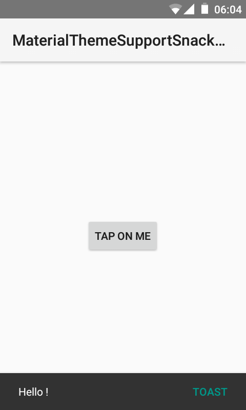

# MaterialThemeSupportSnackbar



> This project features the `Snackbar` tool from the `android.support.design.widget.Snackbar` library  
> It includes the tool `Snackbar` and `SnackbarManager`  
> This project is a port for users of the theme `{@Theme.Material}`  
> `android.support.design.widget.Snackbar` is a `class` not compatible with the theme {@Theme.Material}  
> This project makes it compatible but *Only* usable on Android applications using the {@Theme.Material}  
> This project is a *integrant and complete recovery* of the `android.support.design.widget.Snackbar` library  

## Information

Min API: Android Lollipop  

> This library does not support the {@CoordinatorLayout} ... this update allows you to animate one (or more) view at the same time as the {@Snackbar}  
> Exactly like this, you used the {@CoordinatorLayout} (Download the file APK to see an example)  

# Use

The use of this library is exactly the same as the `android.support.design.widget.Snackbar` library. 

Since the CoordinatorLayout is unsupported, you will need to use the method `avobe(View my_fab);`

To use the  __Above the Snackbar__ function and animate one (or more) view:

```Gradle
Snackbar.make(View view, String message, int duration).above(View my_fab).show();
```

Or

```Gradle
Snackbar.make(View view, String message, int duration).above(View my_fab).setAction(String message_button, View.OnClickListener listener).show();
```


# Material Theme Support Snackbar

<a href="https://raw.githubusercontent.com/MSay2/MaterialThemeSupportSnackbar/master/application/MaterialThemeSupportSnackbar.apk" > </a>

# Clone Git Repository

Please refresh build !

# License

```
Copyright 2017 MSay2

Licensed to the Apache Software Foundation (ASF) under one or more contributor
license agreements. See the NOTICE file distributed with this work for
additional information regarding copyright ownership. The ASF licenses this
file to you under the Apache License, Version 2.0 (the "License"); you may not
use this file except in compliance with the License. You may obtain a copy of
the License at

   http://www.apache.org/licenses/LICENSE-2.0

Unless required by applicable law or agreed to in writing, software
distributed under the License is distributed on an "AS IS" BASIS, WITHOUT
WARRANTIES OR CONDITIONS OF ANY KIND, either express or implied. See the
License for the specific language governing permissions and limitations under
the License.
```


```
Copyright (C) 2015 The Android Open Source Project

Licensed to the Apache Software Foundation (ASF) under one or more contributor
license agreements. See the NOTICE file distributed with this work for
additional information regarding copyright ownership. The ASF licenses this
file to you under the Apache License, Version 2.0 (the "License"); you may not
use this file except in compliance with the License. You may obtain a copy of
the License at

   http://www.apache.org/licenses/LICENSE-2.0

Unless required by applicable law or agreed to in writing, software
distributed under the License is distributed on an "AS IS" BASIS, WITHOUT
WARRANTIES OR CONDITIONS OF ANY KIND, either express or implied. See the
License for the specific language governing permissions and limitations under
the License.
```
